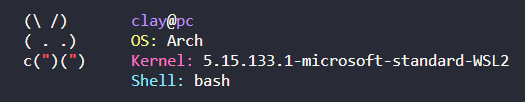

<div align="center">
<h1>bunfetch</h1>
</div>

<div align="center">
  
  
</div>
<div align="center">
<br>
System info fetch utility written in TypeScript and compiled with Bun.

<br>


Bunny ASCII art from [bunnyfetch](https://github.com/Rosettea/bunnyfetch).
</div>

## Installation

1. Install [Bun](https://bun.sh/docs/installation).

```sh 
curl -fsSL https://bun.sh/install | bash
```
2. Clone this repository and build.
```sh
mkdir bunfetch
git clone https://github.com/clhilgert/bunfetch.git
cd bunfetch
bun build --compile ./main.ts --outfile=bunfetch
```
Run
```sh
./bunfetch
```

3. (Optional) Add bunfetch to your $PATH
```sh
sudo mv bunfetch /usr/local/bin
chmod +x /usr/local/bin/bunfetch
```
Run
```sh
bunfetch
```

## Contributing

If you'd like to contribute to this project, please open an issue or a pull request.